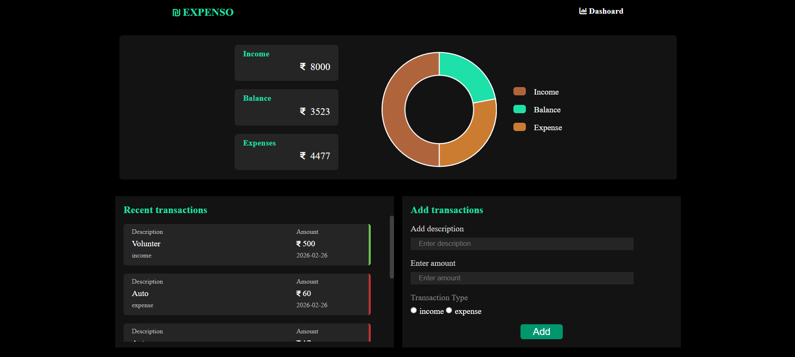
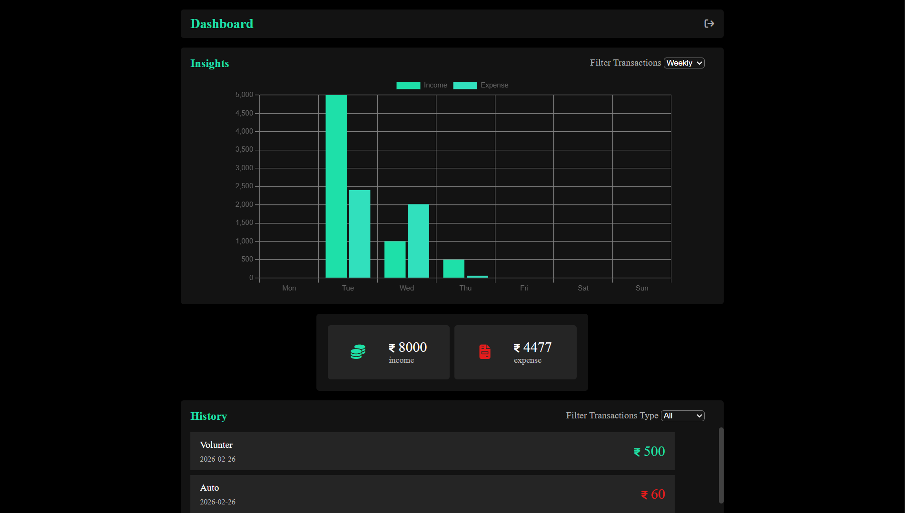

<h1>💰 Expenso</h1>

<strong>Expenso</strong> is an interactive expense tracking web application built using 
<strong>HTML</strong>, <strong>CSS</strong>, and <strong>JavaScript</strong>.  
It enables users to manage transactions, analyze spending patterns, and visualize financial insights through dynamic charts and dashboard filtering.

<h2>📸 Preview</h2>

<h2>🚀 Key Features</h2>
<ul>
    <li>Add and delete income or expense transactions</li>
    <li>Attach description and date to every transaction</li>
    <li>Automatic balance calculation</li>
    <li>Persistent data storage using Local Storage</li>
    <li>Doughnut chart visualizing Income, Expenses, and Balance</li>
    <li>Monthly transaction filtering</li>
    <li>Weekly transaction graph visualization</li>
    <li>Transaction history filters (All / Income / Expenses)</li>
</ul>
<h2>📊 Dashboard Overview</h2>
<ul>
    <li>Total balance tracking</li>
    <li>Income vs Expense breakdown</li>
    <li>Weekly financial trend graph</li>
    <li>Monthly transaction filtering system</li>
</ul>

<h2>🛠 Technologies Used</h2>
<ul>
    <li>HTML5</li>
    <li>CSS3</li>
    <li>Vanilla JavaScript</li>
    <li>Chart.js</li>
</ul>
<h2>🧠 Technical Concepts Implemented</h2>
<ul>
    <li>Dynamic DOM rendering</li>
    <li>Array filtering and aggregation</li>
    <li>Date-based data grouping</li>
    <li>State persistence</li>
    <li>Interactive data visualization</li>
</ul>
